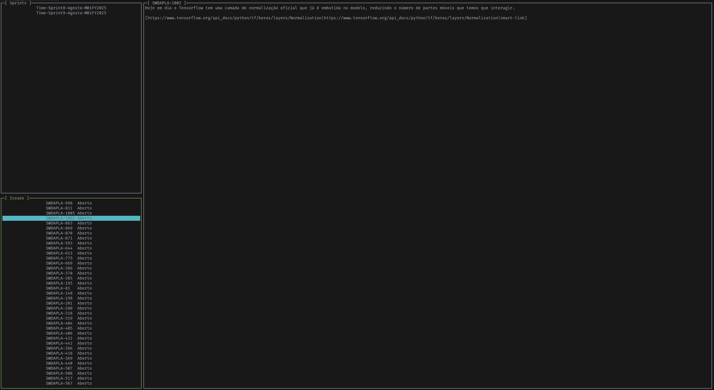

# Tinytui

**THIS LIBRARY IS STILL UNDER DEVELOPMENT, DO NOT USE IN PRODUCTION**

Tinytui's goal is to provide a simple terminal user interface library with the least amount of
dependencies possible.

## Examples

To run examples just `cargo run --example <example_name>`.

## Platform Support

Currently, the only supported platform is Linux.
